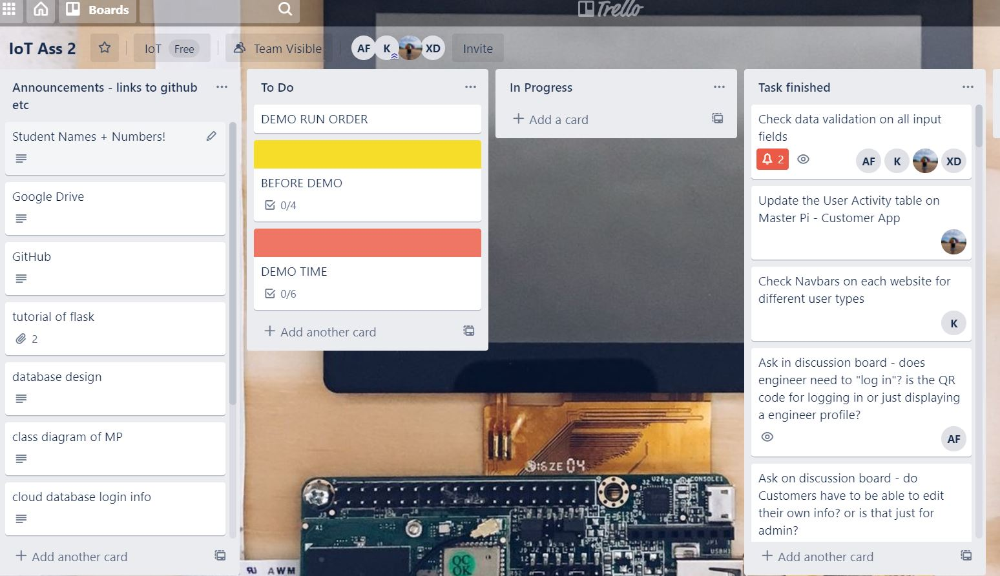
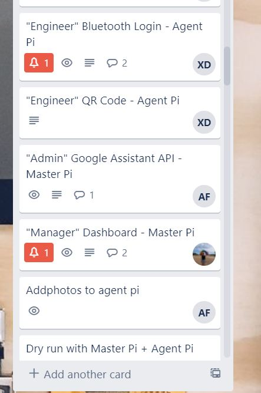
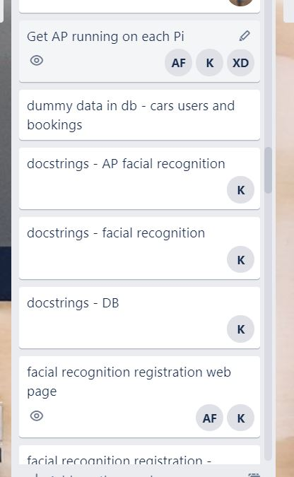
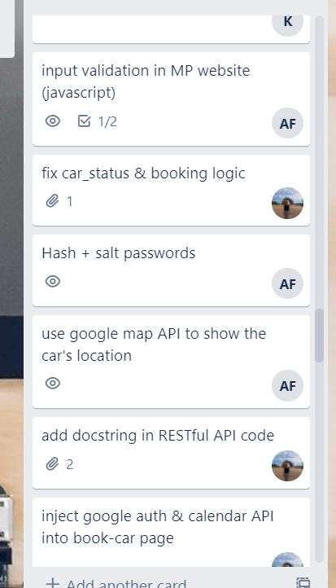
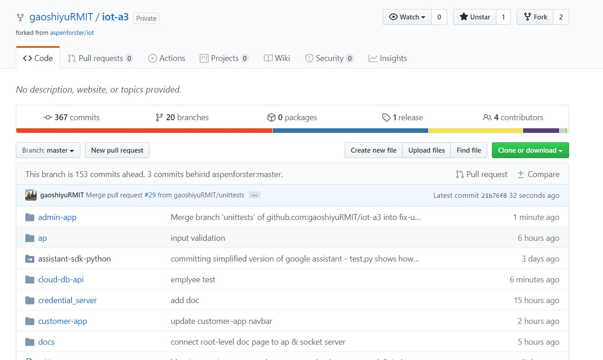
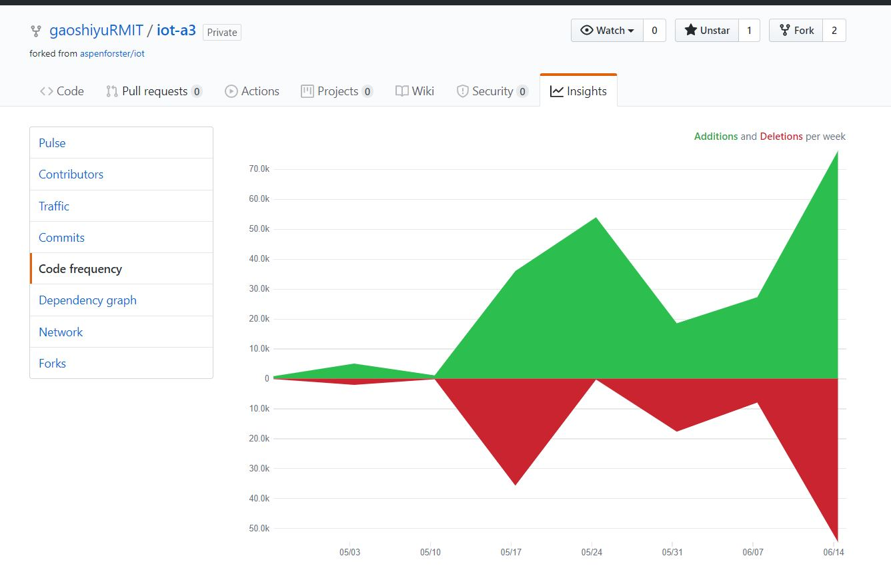
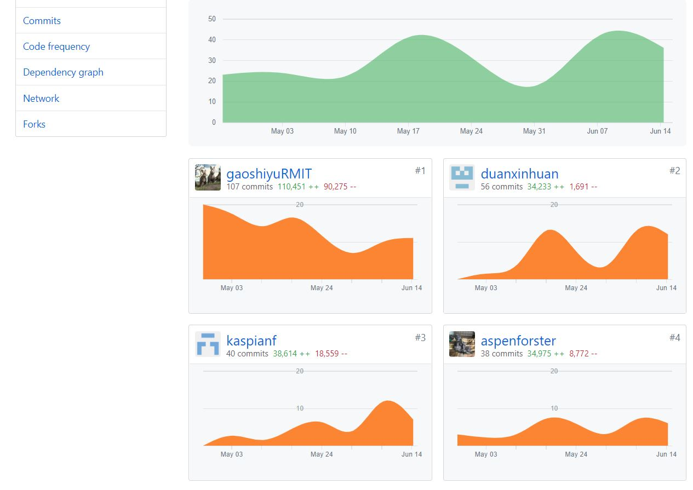

# IoT - Assignment 3

## "Sharing is Car(ing)"

### Team members
- Shiyu Gao s3734720
    - RESTFUL API new functionalities
    - admin website shell 
    - admin website dashboard
    - admin website view, search and report cars & show location
    - root level documentation
    - admin website unit tests
- Aspen Forster s3330837
    - admin website search cars by voice
    - Google Assistant SDK integration
    - project README
- Kaspian Fitzptrick (Kase) s3630115
    - Admin website add, update and remove users & cars
    - admin website documentation
    - unit tests for added endpoints in cloud-db-api
- Xinhuan Duan (Stally) s3713321
    - Agent Pi Admin console app
    - bluetooth auto unlock car
    - QR code recognition

### Test Data
- username: shiyu_admin, role: admin
- username: shiyu_manager, role: manager
- username: shiyu_engineer, role: engineer

### admin-app
admin-app README: [HERE](admin-app/README.md)
#### "admin-app": Booking website to run on the Master Pi
- **<>Service.py** => queries RESTFUL API
- **routes.py** => creates Service objects (see above) and returns results in HTML templates

### cloud-db-api
cloud-db-api README: [HERE](cloud-db-api/README.md)
#### "cloud-db-api": RESTFUL API on the Master Pi - accessed via admin-app
- **<>Manager.py** => creates and executes SQL queries on the Google Cloud SQL instance
- **routes.py** => creates Manager objects (see above) and returns results (to then be passed on to routes.py on admin-app)

### credential_server
Credential Server is run on the Master Pi and listens for the Agent Pi
#### credential server README: [HERE](credential_server/README.md)'

### ap
"ap": Agent Pi Console App allowing customers to unlock/lock cars
#### agent pi README: [HERE](ap/README.md)

### Usage
- For development, you can run the master pi and agent pi from the same machine with this bash script:
- `./start_mp_web.sh`
- the booking web site can be accessed at http://localhost:5000
- the output from flask is redirected admin-app/flask.log and cloud-db-api/flask.log

### Deployment from Source Code
- add cloud-db-api/config.py and admin-app/config.py
- add admin-app/.flaskenv
- ensure no other apps are listening on port 6543 and 5000
- `export python=<python_command_to_use>`
- `./start_mp_web.sh`

### Generating Sphinx Documentation
to generate the API documentation: 
- make sure your virtualenv is activated and has all libraries in requirements.txt installed
- `sphinx-build docs docs/html`
- open docs/html/index.html

### Trello

### Github

